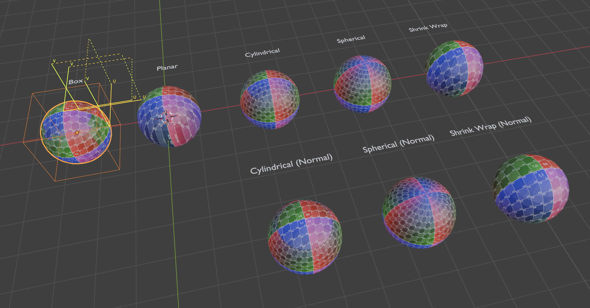
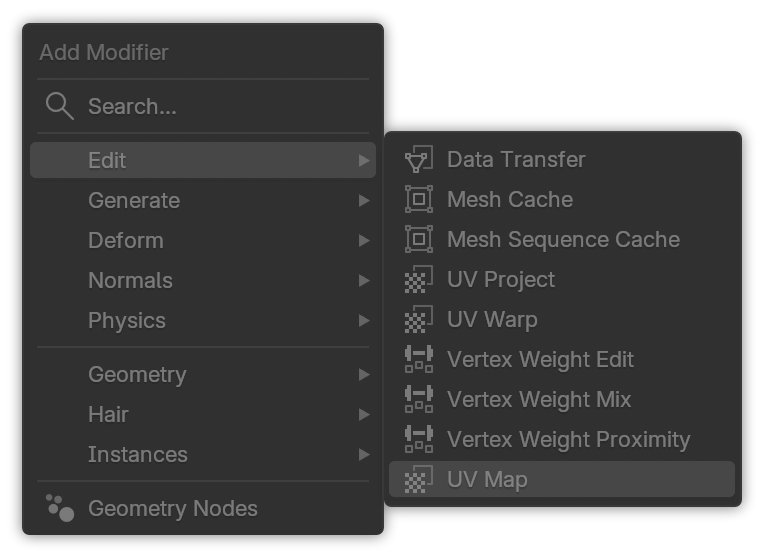
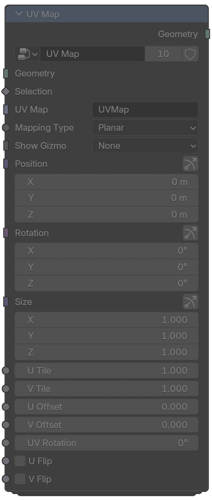
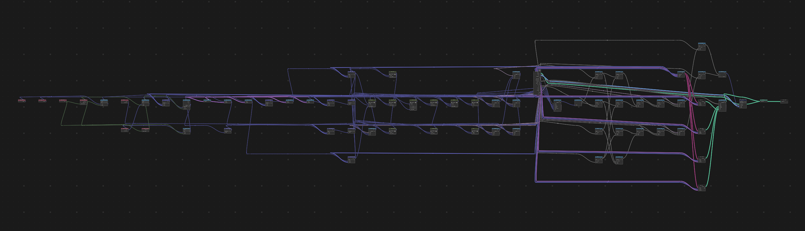

# Prelude LTDA Blender Add-ons

[](https://github.com/Prelude-LTDA/blender-addons/actions/workflows/ci.yml) [](https://github.com/Prelude-LTDA/blender-addons/actions/workflows/release.yml)

Monorepo of Blender add-ons, developed internally to streamline the asset production pipeline for our debut game title, [VARG](https://prelude.ltda/games/varg/).

- UV Map
- Node Layout
- _Voxel Terrain_ (WIP)

Currently targetting **Blender 5.0 and up**, and **Python 3.11**.

## Addons

### UV Map (`uv_map`)

3ds Max-inspired non-destructive procedural UV mapping via **modifier** or **node group**.



#### Features

- **Planar**, **Spherical**, **Cylindrical** (capped, uncapped), **Shrink Wrap** and **Box** (triplanar) projections
- Support for both **position** and **normal-based** modes
- Interactive **gizmos**
- **3d viewport overlay** of UV coordinates
- Position/rotate/scale the projection space
- Offset, tile, flip, and rotate UV coordinates

#### Where to find it

- Modifiers Panel: Add > Edit > UV Map
- Geometry Nodes Editor: Add > Mesh > UV > UV Map

<p align="center">

<br>

</p>

### Node Layout (`node_layout`)

Automatically arrange nodes into a PCB-style layout, with a regular grid and "lanes" with taxicab routing to minimize crossing connections.



Meant as an alternative to the excellent [Node Arrange](https://extensions.blender.org/add-ons/node-arrange/) add-on, with no external/wheel dependencies, and easier to integrate into our other add-ons.

#### Features

- Customize alignment, grid size, lane spacing, and more
- Multiple node sorting strategies
- Supports layout of selected nodes or entire node tree, as well as automatic upstream/downstream node auto-layout when a single node is selected
- Interactive "grab" mode

#### Where to find it

- In any node editor: Node > Auto Layout Nodes
- Also appears in the node editor context menu
- Keyboard Shortcut: `V`

### Voxel Terrain (`voxel_terrain`)

Voxel-based terrain generation and editing tools. **_Still under heavy development._**

#### Features

- Chunk-based generation with LOD support
- Viewport overlays for chunk bounds and voxel grid

## Repo layout

```sh
blender-addons/
├── addons/
│   ├── node_layout/          # Node editor auto-layout add-on
│   ├── uv_map/               # 3ds Max-inspired UV map add-on
│   └── voxel_terrain/        # Voxel terrain add-on
├── shared/                   # Shared Python modules used by the add-ons
├── scripts/                  # Build utilities
├── pyproject.toml
└── README.md                 # You are here
```

## Development Instructions

### Setup

Install Python 3.11 (if not already installed) — This is the version currently targeted by Blender 5.x.

Create and activate virtual environment:

```bash
python3.11 -m venv .venv
```

```sh
source .venv/bin/activate # On macOS/Linux with bash/zsh

#              -- or --

source .venv/bin/activate.fish # If you're using fish shell, like me

#              -- or --

.venv\Scripts\activate # On Windows with PowerShell
```

Install development dependencies:

```bash
pip install -e ".[dev]"
```

3. **Install recommended VS Code extensions** (see `.vscode/extensions.json`)

### Building the extensions (.zip)

This repo includes a helper that builds one or all add-ons into `dist/` using
Blender’s extension builder.

Build all add-ons:

```bash
python scripts/build.py
```

Build a specific add-on:

```bash
python scripts/build.py uv_map
```

If Blender isn’t on your PATH, set `BLENDER_PATH` or pass `--blender`:

```bash
BLENDER_PATH=/Applications/Blender.app/Contents/MacOS/Blender \
   python scripts/build.py
```

### Installing for Development

#### Option 1: Symlink (recommended)

Create a symlink for the add-on you want in Blender's extensions directory
(repeat per add-on):

```bash
# macOS (replace <blender_version> with e.g. 5.0)
ln -s /path/to/repo/addons/uv_map \
   ~/Library/Application\ Support/Blender/<blender_version>/extensions/user_default/uv_map

# Linux
ln -s /path/to/repo/addons/uv_map \
   ~/.config/blender/<blender_version>/extensions/user_default/uv_map

# Windows (run as admin)
mklink /D "%APPDATA%\Blender Foundation\Blender\<blender_version>\extensions\user_default\uv_map" "C:\path\to\repo\addons\uv_map"
```

#### Option 2: Install from Disk

1. Build the extension(s): `python scripts/build.py`
2. In Blender: Edit → Preferences → Addons → Overlow Menu → Install from Disk
3. Select the generated `.zip` file from `dist/`

## Linting & Type Checking

```bash
# Run Ruff linter
ruff check .

# Fix auto-fixable issues
ruff check --fix .

# Format code
ruff format .

# Run Pyright type checker
pyright
```

## License

As required by [Blender licensing guidelines](https://www.blender.org/about/license/) and in compliance with GNU GPLv3, all add-ons in this repo are licensed under: GPL-3.0-or-later

Additionally, all non-Blender-specific code (i.e. code that doesn't directly interface with or reference `bpy` or `mathutils`) is _also_ made available under the more permissive MIT license.
